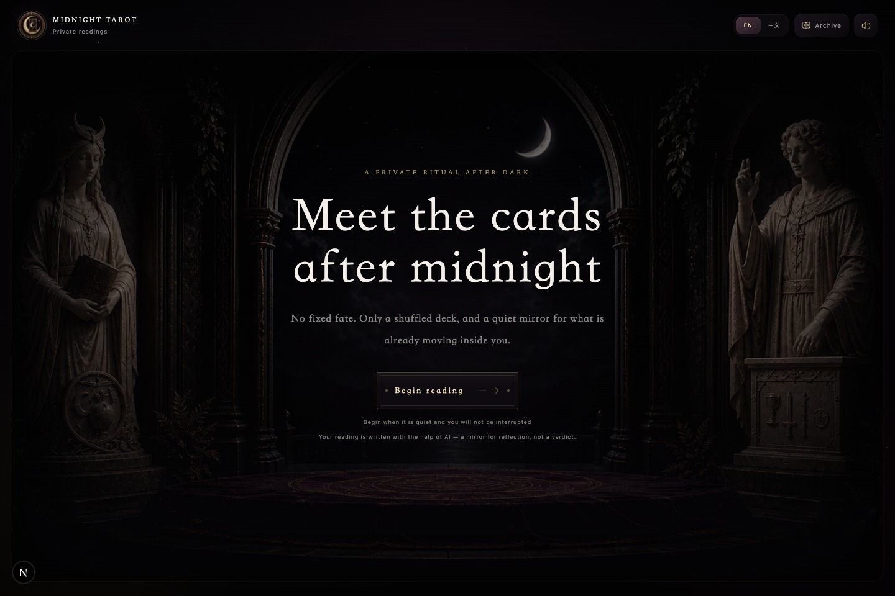
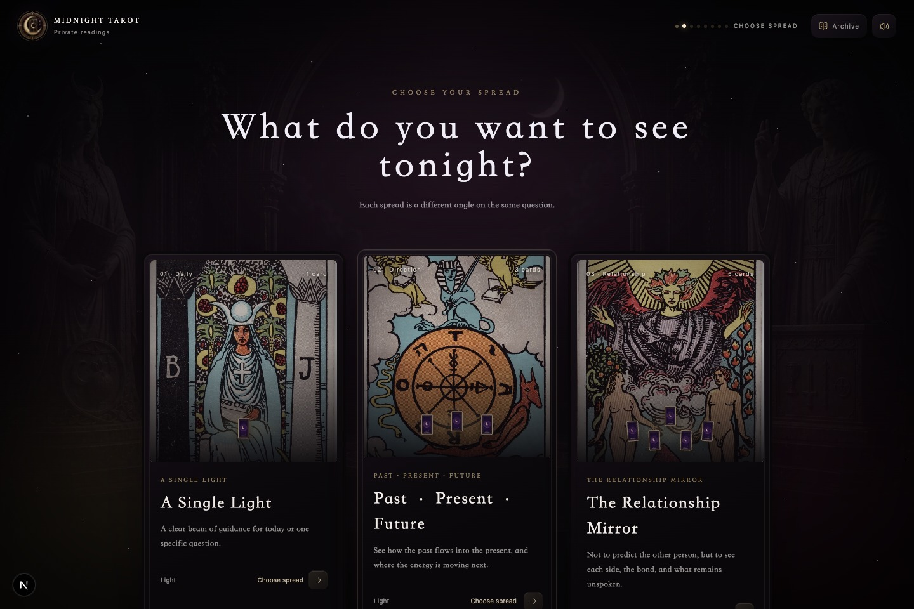
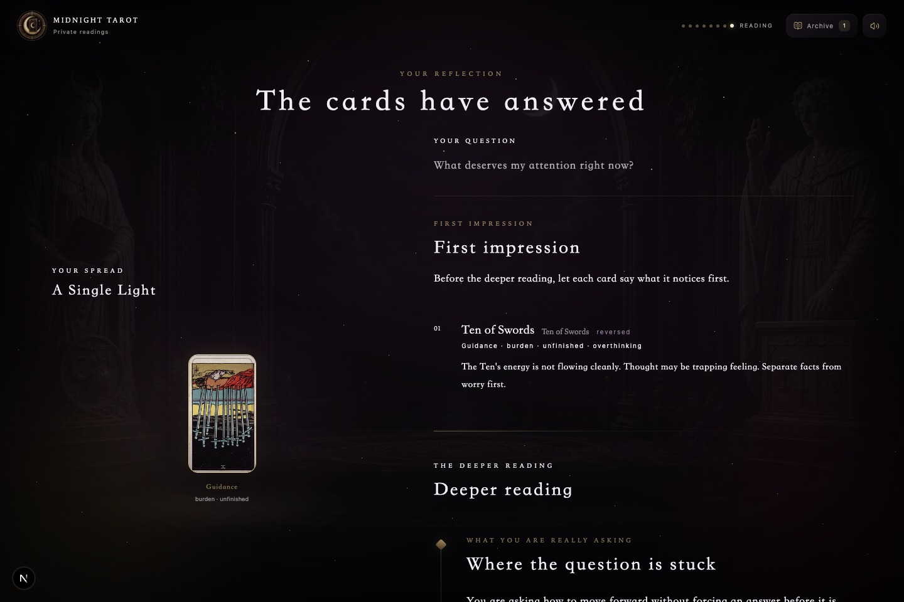
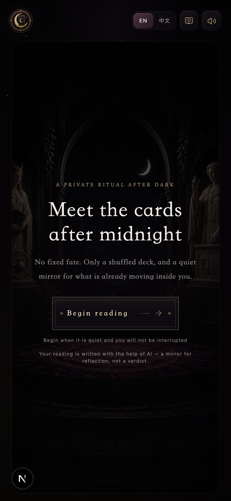

<p align="center">
  
</p>

<h1 align="center">Midnight Tarot</h1>

<p align="center">
  A bilingual, cinematic tarot experience built around a full 78-card deck,<br />
  intentional interaction design, and structured AI-assisted readings.
</p>

<p align="center">
  <strong>Next.js 16</strong> &middot; <strong>TypeScript</strong> &middot; <strong>GSAP</strong> &middot; <strong>DeepSeek</strong> &middot; <strong>Supabase</strong> &middot; <strong>Netlify</strong>
</p>



Midnight Tarot turns a familiar tarot flow into a focused digital ritual. A visitor chooses a spread, holds or writes a question, shuffles the deck, draws from a moving fan, reveals each card, and receives a reading tied to the cards and positions they actually selected.

The current release is free to use. It supports English and Chinese, six spreads, follow-up questions, local reading history, shareable links, and long-form image exports.

> Midnight Tarot is designed for reflection and entertainment. It is not medical, legal, financial, safety, or crisis advice.

## Product Tour

<p align="center">
  
  
</p>

<p align="center">
  
</p>

The experience is organized as one continuous flow:

```text
language -> spread -> intention -> shuffle -> connect -> draw -> reveal -> reading -> follow-up
```

### What users can do

- Draw from the complete Rider-Waite-Smith deck with upright and reversed orientations.
- Choose from one-card, three-card, relationship, career, choice, and Celtic Cross spreads.
- Read the site in English or Chinese without switching tone midway through a session.
- Ask follow-up questions that retain the original question, spread, cards, and reading context.
- Resume an interrupted ritual and keep up to 50 completed readings in the local archive.
- Export a complete reading as a long image or Markdown document.
- Share a reading through an addressable public URL.
- Use keyboard card selection, muted sound, and reduced-motion preferences.

## Engineering Notes

This project is more than a themed form wrapped around an LLM call. The interaction and data contracts are part of the product.

**Stateful ritual flow.** The main experience is an explicit eight-stage state machine. Draft state is recoverable, while completed readings are stored separately so refreshing midway through a draw does not silently discard the session.

**Real deck behavior.** A session shuffles all 78 unique cards with `crypto.getRandomValues`, assigns orientation once, and preserves that deck order through the draw. Selected cards are moved between the fan and spread with GSAP Flip rather than being replaced by unrelated display data.

**Bounded AI output.** The reading endpoint validates the spread, card count, card identity, orientation, and position order before building the prompt. DeepSeek returns a versioned JSON contract. The server validates or repairs that response and falls back to a card-based reading when the upstream request fails.

**Anonymous persistence.** The browser creates a private anonymous credential pair. The server stores only its salted hash, and all Supabase access goes through server routes using the service-role key. Row-level security blocks direct browser access to private reading tables.

**Portable results.** Reading output is rendered into a responsive on-screen manuscript, a long canvas image, a Markdown export, and a compact public reading route from the same underlying data.

## Architecture

```mermaid
flowchart LR
  A[Browser ritual UI] --> B[Next.js App Router]
  A --> C[Local draft and archive]
  B --> D[/api/reading]
  B --> E[/api/readings and /api/followups]
  D --> F[DeepSeek API]
  E --> G[Supabase Postgres]
  A --> H[Canvas and Markdown exports]
```

| Layer | Main choices |
| --- | --- |
| UI | React, TypeScript, Tailwind CSS, Lucide icons |
| Motion | GSAP, `@gsap/react`, Framer Motion |
| Application | Next.js App Router and Node.js route handlers |
| AI | DeepSeek through the OpenAI-compatible SDK |
| Persistence | Browser storage plus Supabase REST |
| Hosting | Netlify Next.js runtime |

## Repository Map

```text
app/                 pages, legal routes, and server API endpoints
components/          ritual, deck, spread, report, and follow-up UI
data/                the 78 cards and six spread definitions
lib/                 prompts, reading contracts, exports, storage, and security helpers
public/cards/        Rider-Waite-Smith artwork and source notes
scripts/             card asset download and integrity checks
supabase/            database schema and migrations
```

## Run Locally

### Prerequisites

- Node.js 20 or newer
- npm
- A DeepSeek API key for generated readings
- A Supabase project for cloud saves, share links, and follow-up history

The core draw and local fallback reading work without external services. The full experience needs both DeepSeek and Supabase.

### 1. Clone and install

```bash
git clone https://github.com/Cynthia0209/midnight-tarot.git
cd midnight-tarot
npm install
```

### 2. Configure the environment

```bash
cp .env.example .env.local
```

At minimum, add a DeepSeek key:

```bash
DEEPSEEK_API_KEY=your_key_here
DEEPSEEK_TIMEOUT_MS=45000
DEEPSEEK_FOLLOWUP_TIMEOUT_MS=30000
NEXT_PUBLIC_SITE_URL=http://localhost:3000
```

`DEEPSEEK_API_KEY` is server-only. Never rename it with a `NEXT_PUBLIC_` prefix or commit `.env.local`.

### 3. Configure Supabase

1. Create a Supabase project.
2. Open the SQL editor and run [`supabase/schema.sql`](supabase/schema.sql).
3. Generate an anonymous-client hashing secret with `openssl rand -hex 32`.
4. Add the server credentials to `.env.local`:

```bash
SUPABASE_URL=https://your-project.supabase.co
SUPABASE_ANON_KEY=your_anon_key
SUPABASE_SERVICE_ROLE_KEY=your_service_role_key
ANON_CLIENT_HASH_SECRET=your_random_64_character_secret
```

The service-role key must remain server-only. `NEXT_PUBLIC_SUPABASE_URL` and `NEXT_PUBLIC_SUPABASE_ANON_KEY` are supported as compatibility fallbacks, but the current browser flow does not require direct database access.

### 4. Start the development server

```bash
npm run dev
```

Open [http://localhost:3000](http://localhost:3000).

## Environment Variables

| Variable | Required | Used for |
| --- | --- | --- |
| `DEEPSEEK_API_KEY` | For AI output | Server-side DeepSeek requests |
| `DEEPSEEK_TIMEOUT_MS` | No | Initial reading timeout |
| `DEEPSEEK_FOLLOWUP_TIMEOUT_MS` | No | Follow-up timeout |
| `NEXT_PUBLIC_SITE_URL` | Production | Canonical share URLs |
| `NEXT_PUBLIC_SUPPORT_EMAIL` | Recommended | Privacy, terms, and support contact |
| `SUPABASE_URL` | Full experience | Server-side Supabase REST endpoint |
| `SUPABASE_ANON_KEY` | Full experience | Supabase project authentication |
| `SUPABASE_SERVICE_ROLE_KEY` | Full experience | Private server-side persistence |
| `ANON_CLIENT_HASH_SECRET` | Full experience | Salted anonymous browser identity |

## Verify a Release

```bash
npm run test:cards
npx tsc --noEmit
npm run build
```

`test:cards` checks the complete 78-card asset set and catches filename or card-image mismatches before a release.

## Deploy to Netlify

Netlify detects this as a Next.js project and installs its Next.js runtime automatically. API routes are deployed as server functions, so this project should not be exported as a static site.

### Recommended: Git-based deployment

1. Push the repository to GitHub, GitLab, or Bitbucket.
2. In Netlify, choose **Add new project -> Import an existing project**.
3. Select the repository and production branch.
4. Set the build command to `npm run build` and the publish directory to `.next`.
5. Add the production environment variables listed above in **Site configuration -> Environment variables**.
6. Set `NEXT_PUBLIC_SITE_URL` to the final `https://` domain, then trigger a fresh deploy.

Every production-branch push will create a production deploy. Pull requests receive isolated deploy previews.

### Optional: Netlify CLI

```bash
npm install -g netlify-cli
netlify login
netlify init
netlify build
netlify deploy
netlify deploy --prod
```

Use the draft deploy first. Confirm one complete reading, one follow-up, one share link, and one image export before promoting it to production.

### Production checks

- Confirm the reading response is AI-generated rather than the local fallback.
- Complete one English and one Chinese reading on both desktop and mobile.
- Open a shared reading in a private browser window.
- Verify that the original private context is absent from the public payload.
- Test the long-image download in Safari and Chrome.
- Confirm `/privacy`, `/terms`, and `/support` show a working contact email.
- Inspect the deployment logs for Supabase or DeepSeek errors.

## Card Artwork

The tarot images are based on the Rider-Waite-Smith deck. Per-card filenames, source URLs, and attribution notes are documented in [`public/cards/SOURCE.md`](public/cards/SOURCE.md). Run `node scripts/download-tarot-assets.mjs` to rebuild the asset set from its recorded sources.

## Safety

The product deliberately frames readings as prompts for reflection rather than predictions or instructions. High-stakes medical, legal, financial, safety, and crisis questions should be taken to an appropriate professional or local emergency resource.
